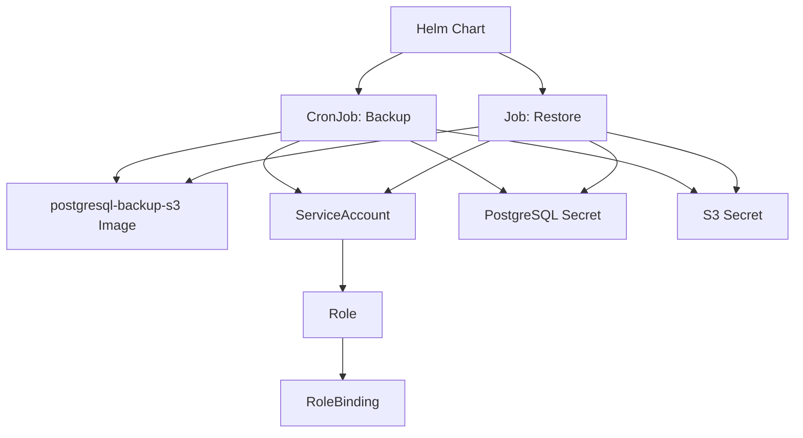

# CNPG-PGDump-Backup Helm Chart Analysis

## Overview
This Helm chart provides an automated PostgreSQL backup and restore solution for CloudNativePG (CNPG) clusters using the `postgresql-backup-s3` Docker image. It supports scheduled backups using `pg_dump` with S3 storage and manual disaster recovery operations.

## Key Components

### 1. Chart Configuration
- **Chart Name**: `cnpg-pgdump-backup`
- **Version**: 0.1.0
- **Type**: Application
- **Dependencies**: Uses the `common` library from bjw-s-labs (version 4.6.2)
- **Docker Image**: `ghcr.io/itbm/postgresql-backup-s3:latest`

### 2. Core Functionality

#### Backup (CronJob)
- **Template**: [`templates/cronjob-backup.yaml`](templates/cronjob-backup.yaml)
- **Image**: `ghcr.io/itbm/postgresql-backup-s3:latest`
- **Features**:
  - Scheduled PostgreSQL backups using `pg_dump`
  - Compression with gzip (configurable level)
  - S3 upload with optional endpoint support (MinIO, etc.)
  - Pre-backup health checks
  - Comprehensive logging
  - Optional retention cleanup

#### Restore (Job)
- **Template**: [`templates/job-restore.yaml`](templates/job-restore.yaml)
- **Image**: `ghcr.io/itbm/postgresql-backup-s3:latest`
- **Features**:
  - Manual restore from S3 backups
  - Safety checks (database empty verification)
  - Force restore option
  - Post-restore verification

### 3. Kubernetes Resources

#### RBAC Resources
- **ServiceAccount**: [`templates/serviceaccount.yaml`](templates/serviceaccount.yaml)
- **Role**: [`templates/role.yaml`](templates/role.yaml)
- **RoleBinding**: [`templates/rolebinding.yaml`](templates/rolebinding.yaml)

### 4. Configuration Options

#### Global Configuration
- Name overrides
- Image configuration (postgresql-backup-s3:latest by default)
- Labels and annotations
- Image pull secrets

#### CNPG Cluster Configuration
- Secret name for PostgreSQL credentials
- Database name
- Service name for discovery

#### S3 Storage Configuration
- Prefix/path within bucket
- AWS region
- S3 endpoint (for MinIO or S3-compatible storage)
- Secret name for S3 credentials
- Storage class

#### RBAC Configuration
- Create RBAC resources (enabled by default)
- Service account name
- Extra role rules
- PSP support

#### Controller Configuration
- **CronJob**: Schedule, concurrency policy, history limits, resources
- **Job**: TTL, backoff limit, resources, annotations

### 5. Security Features

#### Pod Security
- Non-root execution (runAsUser: 999)
- Read-only root filesystem
- Capability dropping (ALL)
- No privilege escalation

#### Secrets Management
- PostgreSQL credentials from Kubernetes secrets
- S3 credentials from Kubernetes secrets
- Environment variable mapping for AWS compatibility

### 6. Docker Image Features

The chart uses the `postgresql-backup-s3` Docker image which provides:

#### Built-in Backup Functionality
- PostgreSQL backup using `pg_dump`
- Environment validation
- Connectivity checks
- Compression with configurable levels
- S3 upload with verification
- Optional retention cleanup
- Detailed logging

#### Built-in Restore Functionality
- PostgreSQL restore from S3 backups
- Safety checks (empty database verification)
- S3 download
- Database restore with decompression
- Post-restore verification
- Force restore option

### 7. Test Manifests

The `test-manifest` directory contains resources for testing:
- **PostgreSQL Deployment**: [`test-manifest/deployment.yaml`](test-manifest/deployment.yaml)
- **PostgreSQL Service**: [`test-manifest/service.yaml`](test-manifest/service.yaml)
- **PostgreSQL Secret**: [`test-manifest/secret.yaml`](test-manifest/secret.yaml)
- **Initialization ConfigMap**: [`test-manifest/configmap.yaml`](test-manifest/configmap.yaml)
- **AWS Secret Creation**: [`test-manifest/create-aws-secret.md`](test-manifest/create-aws-secret.md)

### 8. Validation and Error Handling

The chart includes comprehensive validation:
- Required values validation (secrets, schedules)
- Environment variable validation in scripts
- PostgreSQL connectivity checks
- Backup file verification
- S3 upload/download verification
- Proper error logging and cleanup

### 9. Backward Compatibility

The chart maintains backward compatibility with legacy configuration:
- Fallback from `controllers.cronjob` to `backup` values
- Fallback from `controllers.job` to `restoreLegacy` values

## Architecture Diagram

## Usage Scenarios

1. **Scheduled Backups**: Deploy with CronJob enabled to automatically backup PostgreSQL databases to S3 on a schedule
2. **Disaster Recovery**: Use the restore Job to recover databases from S3 backups
3. **Migration**: Use backup and restore functionality to migrate databases between environments

## Key Features

- **Flexible S3 Storage**: Supports AWS S3, MinIO, and other S3-compatible storage solutions
- **Comprehensive Security**: Follows Kubernetes security best practices
- **Robust Error Handling**: Detailed logging and proper cleanup on failures
- **Validation**: Ensures required configuration is provided
- **Backward Compatibility**: Maintains compatibility with legacy configurations

## Implementation Changes

### Migration to postgresql-backup-s3 Image

The chart has been updated to use the `ghcr.io/itbm/postgresql-backup-s3:latest` Docker image instead of the previous implementation that used Alpine Linux with manual script installation. Key changes:

1. **Removed Components**:
   - Custom `backup.sh` and `restore.sh` scripts
   - Scripts ConfigMap
   - Init containers for dependency installation
   - Manual volume mounts for scripts and tools

2. **Simplified Templates**:
   - CronJob and Job templates now directly use the Docker image
   - Environment variables updated to match image expectations
   - Removed complex volume mounting and script execution

3. **Benefits**:
   - Reduced complexity and maintenance overhead
   - Leverages a well-maintained Docker image
   - Consistent backup/restore behavior
   - Smaller attack surface

## Conclusion

This Helm chart provides a production-ready solution for PostgreSQL backup and restore operations in Kubernetes environments, specifically designed for CloudNativePG clusters. It now uses the `postgresql-backup-s3` Docker image for simplified deployment and maintenance, offering comprehensive features for scheduled backups, disaster recovery, and secure credential management while following Kubernetes best practices.