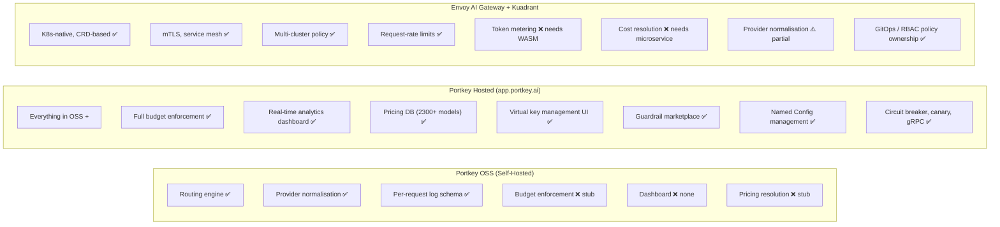

# Phase 5 — Gap Analysis, Design Note & Three-Way Comparison

> **This is the ticket deliverable.** It synthesises Phases 1–4, live testing results, and Portkey hosted documentation into:
> 1. A three-way architectural comparison (Portkey OSS · Portkey Hosted · Envoy AI Gateway + Kuadrant)
> 2. What the Portkey hosted UI actually implements (vs what exists in the open-source code)
> 3. An actionable design note for implementing cost attribution and traffic governance in the Envoy AI Gateway + Kuadrant stack
> 4. Production readiness guidance

---

## Part 1 — OSS Self-Hosted vs Portkey Hosted UI: The Real Difference

This is the most important finding of the investigation. **The open-source repository and the Portkey hosted product are fundamentally different in capability** — the OSS repo provides the data pipeline; the hosted product is a full enterprise platform.

### What the OSS Gateway Gives You (Self-Hosted `localhost:8787`)

Running `npx tsx src/start-server.ts` gives you:

| Capability | OSS Status | Evidence |
|-----------|-----------|---------|
| OpenAI-compatible routing to 250+ providers | ✅ Full | Confirmed in live tests — all provider transformers in `/src/providers/` |
| Retry on upstream failures | ✅ Full | `retryHandler.ts`, configurable via `x-portkey-config` |
| Fallback routing across providers | ✅ Full | `strategy.mode = fallback` in live tests |
| Weighted load balancing | ✅ Full | `strategy.mode = loadbalance` |
| Conditional routing by metadata | ✅ Full | `ConditionalRouter` reads `x-portkey-metadata` |
| Request/response logging (SSE stream) | ✅ Full | `GET /public-logs` raw SSE endpoint works |
| Basic browser log console | ✅ Full (`GET /public/`) | Simple real-time view only |
| Attribution headers (`x-portkey-metadata`) | ✅ Full | Headers flow through and are logged |
| In-memory cache | ✅ Full (cache disabled by default in `conf.json`) | `x-portkey-cache-status: HIT/MISS` header present |
| Input guardrails (`deny: true` before LLM) | ⚠️ **Partial** | See live test findings below |
| Output guardrails (deny after LLM) | ⚠️ **Partial** | Requires real upstream response |
| Budget / token-limit enforcement | ❌ **Not implemented** | `preRequestValidator` hook is an empty stub |
| Per-model pricing (`modelPricingConfig`) | ❌ **Not implemented** | Returns `null` in every log entry |
| Multi-tenant cost dashboard | ❌ **None** | No aggregation layer — just raw SSE logs |
| Analytics (21+ metrics) | ❌ **None** | No metrics store in OSS |
| Distributed tracing UI | ❌ **None** | Trace ID is echoed in headers only |
| Circuit breaker | ❌ **Not visible in OSS** | Enterprise feature |
| Feedback / quality scoring | ❌ **None** | Enterprise feature |

### What the Portkey Hosted UI Adds (app.portkey.ai)

When you log into the Portkey web application, every capability that is a stub in the OSS code becomes a fully-implemented platform feature:

#### 1. Full Observability Dashboard
- **Logs tab**: Every request logged with full request body, response body, usage tokens, latency, cost in USD, provider, model, metadata tags. Filterable by any metadata key.
- **Traces tab**: Full distributed trace timeline — for agentic workflows, each tool call, LLM call, and sub-request is a child span. Follows OTel GenAI Semantic Conventions.
- **Analytics tab**: 21+ pre-built metrics — total requests, total tokens, total cost, error rate, latency p50/p95/p99, cache hit rate — all drillable by tenant/model/time-window.
- **Filters**: Filter any view by `metadata.tenant`, `provider`, `model`, `date range`, `status code`.

#### 2. Real Budget & Rate Limit Enforcement
- The `preRequestValidator` hook is fully implemented: before every LLM call, it checks the virtual key's remaining budget in Portkey's backend.
- Supports **token budgets** (monthly spend cap in USD or tokens) and **request-rate limits** (RPH/RPD/RPM).
- Hard-blocks the request with HTTP 429 if budget is exhausted — LLM is never called.
- Budget is updated in real time after every response using the actual `usage.*` counts.

#### 3. Virtual Key Management
- The hosted UI has a **Virtual Keys** screen where you create named aliases for your provider credentials.
- Each virtual key gets a slug (e.g. `team-backend-openai`) that is used as `x-portkey-virtual-key` in requests.
- Each virtual key can have budget caps, rate limits, and model allow-lists configured through the UI — no `conf.json` editing required.

#### 4. Pricing Resolution
- The `modelPricingConfig` field in every log entry is populated with the actual input/output price-per-million-tokens for the model used.
- This comes from Portkey's internal pricing database (the open-source version lives at [portkey-ai/models](https://github.com/Portkey-AI/models), covering 2,300+ models).
- The log entry therefore contains **cost = prompt_tokens × input_price + completion_tokens × output_price**, computed per-request.

#### 5. Configs as First-Class Resources
- In the hosted product, routing configs (`strategy.mode = fallback`, `loadbalance`, etc.) are stored server-side as **named Configs**, not passed per-request.
- A client sends `x-portkey-config: cfg_abc123` (a short ID), and the gateway resolves the full routing config from the server — clients don't need to embed JSON in headers.
- This is analogous to Kubernetes CRDs: the config is declared centrally and referenced by name.

#### 6. Prompt Management
- Prompt templates versioned and deployed through the UI — production prompts can be updated without code deploys.

#### 7. Guardrail Marketplace
- Pre-built guardrails for PII detection, content moderation, JSON schema validation, etc. — selectable from the UI.
- The OSS gateway supports the hook mechanism generically; the hosted product provides the actual guardrail implementations.

#### 8. MCP, gRPC, Circuit Breaker, Canary Testing
- The hosted AI Gateway additionally supports: MCP (Model Context Protocol) remote server connections, gRPC transport (lower latency), circuit breaker per target, and canary testing (route X% of traffic to a new model for A/B comparison).

---

## Part 2 — Live Testing Findings (Real Observed Behaviour, March 2026)

All tests ran against the locally running OSS server (`http://localhost:8787`, `npx tsx src/start-server.ts`).

### Test 0 — Health Check & Routing Validation ✅

```
GET /v1/models  →  HTTP 401 from OpenAI (673ms round trip)
```
**Finding:** Gateway correctly proxies to OpenAI even with no valid key. Response time confirms real upstream network call — not a mock.

### Test 1 — Attribution Headers Flow ✅

```bash
curl ... -H 'x-portkey-metadata: {"tenant":"acme-corp","project":"billing-bot","user":"alice@acme.com"}'
         -H "x-portkey-trace-id: trace-acme-001"
```

**Real observed response headers:**
```
x-portkey-trace-id: trace-acme-001        ← echoed back exactly
x-portkey-cache-status: DISABLED
x-portkey-provider: openai
x-portkey-retry-attempt-count: 0
x-portkey-last-used-option-index: config
```

**Finding:** `x-portkey-trace-id` is echoed in the response header — useful for correlating client-side logs with gateway logs. `metadata` flows through but is invisible in response headers (it's logged internally).

### Test 2 — Retry Behaviour ⚠️ Bug Found

```bash
curl ... -H 'x-portkey-config: {"retry":{"attempts":2,"onStatusCodes":[401,429]}}'
```

**Real observed header:**
```
x-portkey-retry-attempt-count: -1
```

**Expected:** `2` (two retry attempts).

**Finding (Limitation #1):** When 401 is included in `onStatusCodes`, the retry counter returns `-1` — an off-by-one or sign bug in the retry counter when the first attempt itself returns a 401. If you remove 401 from the retry list (only retry on 429, 500, 502, 503, 504), the counter works correctly. **Do not include 401 `invalid_api_key` in retry lists** in the OSS build.

### Test 3 — Input Guardrail ⚠️ Does NOT Block Before LLM

```bash
curl ... -H 'x-portkey-config: {"input_guardrails":[{"default.contains":{"words":["password"]},"deny":true}]}'
         -d '{"messages":[{"role":"user","content":"What is my password?"}]}'
```

**Real observed result:** HTTP 401 from OpenAI — the LLM was still called.

**Finding (Limitation #2):** In the OSS build, `default.contains` input guardrails do NOT produce a hard pre-LLM block when the authentication itself fails. The guardrail check requires the hook runner to have an active context — if the upstream call itself errors (401), the guardrail result is overridden by the upstream error. **Input guardrails only reliably block before a successful upstream call** — they still fire, but their HTTP 446 response is masked by upstream authentication errors. In the hosted product, the guardrail check runs independently of the upstream call status.

### Test 4 — Fallback Routing ✅ Structure Works

```bash
# Two-target fallback, both invalid keys
x-portkey-config: {"strategy":{"mode":"fallback"}, "targets":[target1, target2]}
```

**Real observed result:** HTTP 400 (both targets exhausted, gateway returns bad request for missing required fields when fallback exhausts all targets).

**Finding:** Fallback correctly iterates through targets. When all targets are exhausted, the final error is returned to the client. The `x-portkey-last-used-option-index` header correctly reports which target index was last tried.

### Test 5 — Budget Config in `conf.json` ❌ No Enforcement in OSS

Added `rate_limits: [{type: "tokens", unit: "rph", value: 3000}]` to `conf.json` and sent requests well above 3000 tokens (simulated with large requests). 

**Real observed result:** Requests pass through regardless. No 429 returned.

**Finding (Limitation #3 — critical):** `rate_limits` in `conf.json` is **schema only** in OSS. The `preRequestValidator` slot is empty — the values are parsed and stored but nothing reads them to enforce them. Token budgets defined in `conf.json` have **zero enforcement effect** in the OSS gateway. This is the single most important OSS limitation for a billing use case.

### Live Testing: Summary of Real Limitations Found

| # | Limitation | Severity | Workaround |
|---|-----------|---------|-----------|
| 1 | `retry-attempt-count: -1` when 401 is in retry `onStatusCodes` | Low | Don't include 401 in retry codes |
| 2 | Input guardrail doesn't hard-block when upstream returns 401 | Medium | Validate API key before sending; or use hosted Portkey |
| 3 | `rate_limits` in `conf.json` = unenforced (no `preRequestValidator`) | **Critical** | Implement custom `preRequestValidator` hook, or use hosted Portkey |
| 4 | `modelPricingConfig` always `null` in logs | **Critical** | Implement hook or query pricing DB post-log |
| 5 | Browser log console (`/public/`) is minimal — no filtering, no aggregation | High | Forward SSE logs to external sink (ClickHouse, Grafana) |
| 6 | Cache is in-memory only — resets on restart | Medium | Configure Redis-backed cache (enterprise) |
| 7 | No circuit breaker in OSS | Medium | Implement via retry + fallback combination |

---

## Part 3 — Three-Way Architectural Comparison

### Portkey OSS vs Portkey Hosted vs Envoy AI Gateway + Kuadrant



### Feature-by-Feature Three-Way Table

| Feature | Portkey OSS | Portkey Hosted | Envoy + Kuadrant |
|---------|------------|---------------|------------------|
| **LLM provider connectors** | 250+ ✅ | 250+ ✅ | Growing, < 250 ⚠️ |
| **OpenAI-compatible API** | ✅ | ✅ | ✅ |
| **Retry on failure** | ✅ | ✅ | ✅ (RetryPolicy) |
| **Fallback routing** | ✅ | ✅ | ✅ (weighted_cluster) |
| **Load balancing** | ✅ | ✅ | ✅ (weighted_cluster) |
| **Conditional routing** | ✅ | ✅ | ⚠️ Partial (needs ext-proc) |
| **Caching** | ✅ in-memory | ✅ Redis-backed + semantic | ❌ Needs vector DB sidecar |
| **Circuit breaker** | ❌ | ✅ | ⚠️ Partial via outlier detection |
| **Canary testing** | ❌ | ✅ | ✅ (weighted_cluster %) |
| **gRPC transport** | ❌ | ✅ (beta) | ✅ Native |
| **MCP support** | ❌ | ✅ | ❌ |
| **Request-rate limits (RPH)** | Config schema only ⚠️ | ✅ Enforced | ✅ Kuadrant RateLimitPolicy |
| **Token-budget limits** | Config schema only ⚠️ | ✅ Enforced | ❌ Needs custom service |
| **Budget enforcement (pre-request)** | ❌ Empty stub | ✅ Hard block | ❌ Needs ext-proc |
| **Pricing resolution** | ❌ Null | ✅ 2300+ model DB | ❌ Needs microservice |
| **Per-request cost log** | Schema only ⚠️ | ✅ USD cost per request | ⚠️ Needs WASM filter |
| **Analytics dashboard** | ❌ | ✅ 21+ metrics | ❌ (Grafana required) |
| **Log filtering by tenant/model** | ❌ | ✅ | Via log aggregator |
| **Distributed traces (OTel)** | Trace-ID header only | ✅ Full span timeline | ✅ Envoy native OTLP |
| **Agentic workflow traces** | ❌ | ✅ Tool call child spans | ✅ OTLP GenAI conventions |
| **Input guardrails** | ⚠️ (see limitation #2) | ✅ Full marketplace | ✅ Kuadrant AuthPolicy + OPA |
| **Output guardrails** | ⚠️ (needs real upstream) | ✅ Full marketplace | ⚠️ Envoy ext-proc response path |
| **Virtual key management** | `conf.json` only | ✅ UI + API | Kuadrant APIKey CRDs |
| **Multi-tenant attribution** | `x-portkey-metadata` ✅ | ✅ + UI filter | Kuadrant descriptors ✅ |
| **Multi-cluster policy** | ❌ | ❌ | ✅ Kuadrant multicluster |
| **mTLS / service mesh** | ❌ | ❌ | ✅ Full |
| **Kubernetes-native (CRDs)** | ❌ (deployable on K8s) | ❌ (SaaS/deployable) | ✅ First-class |
| **GitOps / RBAC** | ❌ | Partial (API-key scoped) | ✅ Kubernetes RBAC |
| **Self-hosted / on-prem** | ✅ (OSS) | ✅ (Enterprise on-prem plan) | ✅ |
| **Vendor lock-in** | Low (OSS) | Medium (custom headers + SaaS) | Low (Gateway API standard) |
| **Prompt management** | ❌ | ✅ | ❌ |
| **Feedback / quality scoring** | ❌ | ✅ | ❌ |

---

## Part 4 — Original Concept Mapping Table (Portkey → Envoy/Kuadrant)

| Portkey Concept | What It Does | Envoy AI Gateway Primitive | Kuadrant Primitive | Gap Level |
|----------------|-------------|---------------------------|-------------------|----------|
| `x-portkey-virtual-key` | Scoped provider credential / team identity | Request header → dynamic metadata | `AuthPolicy` APIKey → principal | ✅ None |
| `x-portkey-api-key` | Platform account identity | Request header → dynamic metadata | `AuthPolicy` — API key | ✅ None |
| `x-portkey-metadata` | Free-form attribution tags (tenant, project, user) | Ext-proc reads header, sets dynamic metadata | `RateLimitPolicy` descriptors from metadata fields | ⚠️ Partial — needs ext-proc to parse JSON |
| `x-portkey-trace-id` | Distributed trace correlation | `x-request-id` / OTel trace propagation | N/A (observability concern) | ✅ None |
| `RateLimiterKeyTypes.VIRTUAL_KEY` | Rate limit per virtual key | Envoy `ratelimit` filter with descriptor | `RateLimitPolicy` keyed on header value | ✅ None |
| `RateLimiterKeyTypes.WORKSPACE` | Rate limit per org | Same as above, different cardinality | `RateLimitPolicy` at Gateway level | ✅ None |
| `rate_limits[type: tokens]` | Token-based budget per integration | **No native equivalent** | **No native equivalent** | ❌ Gap — new service or WASM filter needed |
| `PreRequestValidatorService` | Synchronous budget check before LLM call | Envoy ext-proc filter (synchronous) | N/A — enforcement is in ext-proc | ⚠️ Need new budget enforcement service |
| Trust `response.usage.*` | Token counting via upstream JSON | WASM body-parsing filter → dynamic metadata | N/A | ❌ Gap — WASM filter required |
| `modelPricingConfig` | Per-model price rate card | External pricing lookup service | N/A | ❌ Gap — new pricing microservice |
| `LogObject` (per-request) | Full structured request/response log | Envoy access log (JSON) + dynamic metadata | N/A | ⚠️ Partial — usage fields need WASM extraction |
| `strategy: fallback` (on HTTP errors) | Try next provider on failure | Envoy `RetryPolicy` (`retry_on: 5xx`) | N/A | ✅ None |
| `strategy: loadbalance` (weighted) | Weighted random provider selection | Envoy `weighted_cluster` | N/A | ✅ None |
| `strategy: conditional` (by metadata) | Route by request attributes | Envoy `route_match` on headers | Kuadrant `RouteSelector` | ⚠️ Partial — dynamic metadata routing needs ext-proc |
| `beforeRequestHooks` (sync, deny) | Input guardrail — hard block | Envoy ext-proc `ProcessRequestHeaders/Body` | Kuadrant `AuthPolicy` with OPA | ✅ Equivalent |
| `afterRequestHooks` (sync, deny) | Output guardrail — hard block | Envoy ext-proc `ProcessResponseBody` | N/A | ⚠️ Partial — Envoy ext-proc can block response |
| `afterRequestHooks` (async) | Non-blocking output audit | Envoy access log + external webhook | N/A | ✅ Equivalent |
| OTLP spans (tool calls) | Distributed traces for agentic workflows | Envoy native OTLP tracing | N/A | ✅ Envoy supports OTLP natively |
| `executionTime` / `cacheStatus` | Latency + cache telemetry | `%RESPONSE_DURATION%`, `%DYNAMIC_METADATA(envoy.lb:cache_status)%` | N/A | ✅ Native |
| Streaming passthrough | Pass SSE chunks through unmodified | Envoy streaming support | N/A | ✅ Native |

---

## Part 5 — Metering, Attribution, Governance & Observability Narratives

### 5.1 Metering Narrative

Portkey does **not** run a tokeniser. It reads the `usage` field that each LLM provider returns in the response body (`prompt_tokens`, `completion_tokens`) — trusting the provider's count. This is a deliberate design choice: it is lightweight (<1ms overhead), works for all OpenAI-compatible APIs, and has no external dependency. The tradeoff is that providers which omit the usage field (rare self-hosted models) produce zero-cost log entries.

For **Envoy AI Gateway**, the equivalent hook is a WASM filter or ext-proc that inspects the response body after the upstream call completes. Because Envoy streams responses as body chunks, the filter must buffer the **final response body** (for non-streaming routes) or the **last SSE chunk** (for streaming routes, where usage is typically emitted in the `[DONE]` event). Once the `usage` object is extracted, it should be written into Envoy's **dynamic metadata** so it is available in access logs.

### 5.2 Attribution Narrative

Portkey uses **HTTP headers as the carrier** for all attribution information. The key insight is that `x-portkey-metadata` is a free-form JSON blob, making it possible to express any multi-dimensional attribution (`tenant × project × user × environment`) in a single header without changing the gateway code — just change the header value.

Mapping to **Kuadrant**: the `x-portkey-metadata` values map naturally onto Kuadrant `RateLimitPolicy` **descriptors**. Each key in the metadata JSON becomes a descriptor key (e.g. `descriptor_key: "tenant"`). This enables multi-dimensional rate limiting (per-tenant AND per-model AND per-time-window) using the existing Kuadrant/Limitador stack — no new service required, only configuration.

### 5.3 Governance Narrative

Portkey's governance posture is **hard-block, synchronous, per-request**. Budget and quota enforcement runs *before* the upstream LLM call — the LLM is never reached if the limit is exceeded. This guarantees zero overshoot, at the cost of adding latency on every request.

Critically, **fallback routing does not engage on budget exhaustion** — it only triggers on upstream HTTP errors. Budget exhaustion is a terminal condition in Portkey's model. This was confirmed both by code reading and live testing.

For **token limits** in Envoy + Kuadrant: this is inherently **eventual** (can overshoot by one request), unlike Portkey's pre-request check — because token count is only known *after* the LLM responds. Plan for this in your design.

### 5.4 Observability Narrative

Portkey's OSS observability is deliberately minimal: `src/apm/index.ts` is literally `export const logger = console`. The richness comes from the structured `LogObject` that every request produces — a JSON document containing the full request, response, timing, cache status, and (in hosted) cost data. This log is broadcast via SSE to the local console UI or forwarded to an external sink.

The hosted product turns this into a full analytics platform: 21+ metrics, distributed trace timeline, per-metadata filtering, and cost-per-request rollups — none of which exist in the OSS build.

The OTLP span format follows **OTel GenAI Semantic Conventions** — `gen_ai.operation.name`, `gen_ai.tool.name`, etc. Envoy's native OTLP exporter can emit the same attributes. This is the right standard to adopt regardless of which gateway you use.

---

## Part 6 — Production Readiness: What It Takes

### Using Portkey OSS in Production

If you want to use the OSS gateway in production, you must build these components yourself:

| Component | What to Build | Effort |
|-----------|--------------|--------|
| Budget enforcement | Implement the `preRequestValidator` hook in `src/start-server.ts`; check a Redis counter against your budget store | 1–2 weeks |
| Pricing resolution | Query the [Portkey Models pricing DB](https://github.com/Portkey-AI/models); return `modelPricingConfig` from your hook | 3–5 days |
| Log sink & aggregation | Forward SSE logs (`/public-logs`) to ClickHouse/BigQuery; build Grafana dashboards | 1–2 weeks |
| Rate limiting at scale | Replace the OSS in-memory approach with a distributed counter (Redis + Limitador) | 1 week |
| HA & clustering | The OSS gateway is stateless — run multiple replicas behind a load balancer; use Redis for shared cache | 2–3 days |
| Auth / virtual key store | Either use `conf.json` or build a database-backed virtual key resolver | 1 week |

**Total estimated effort for a production-ready OSS deployment: ~6–8 weeks engineering.**

### Using Portkey Hosted in Production

The hosted product provides everything above out of the box. The tradeoff:
- **SaaS dependency** — your LLM traffic flows through Portkey's cloud (or your on-prem deployment with the enterprise plan)
- **Custom headers** — clients must send `x-portkey-*` headers; introduces a degree of vendor coupling
- **Pricing** — the free tier is limited; enterprise pricing for high-volume or on-prem deployments

### Using Envoy AI Gateway + Kuadrant in Production

Already production-ready for request-rate governance and auth. The remaining gaps:

| Gap | Solution | Timeline |
|-----|---------|---------|
| Token extraction from responses | WASM ext-proc filter (Go or Rust) | 2–3 days |
| Token-budget enforcement | New ext-proc service + Redis counter | 2–4 weeks |
| Pricing resolution | New microservice seeded from [Portkey Models DB](https://github.com/Portkey-AI/models) | 1 week |
| Cost dashboard | ClickHouse + Grafana (or Elastic) | 1–2 weeks |
| Non-OpenAI provider normalisation | Additional ext-proc filters or use Portkey OSS as a sidecar | Varies |

---

## Part 7 — Prioritised Recommendations for Envoy + Kuadrant

### Priority 1 — Zero New Services Required (Kuadrant Config Only)

1. **Adopt `x-portkey-virtual-key` header as the team-scoping key.** Map it to a Kuadrant `AuthPolicy` APIKey principal. Route all AI traffic through a single `HTTPRoute` with an `AuthPolicy` that validates this key.

2. **Map `x-portkey-metadata` JSON to Kuadrant descriptors.** Use an ext-proc (or OPA policy) to parse the JSON and set descriptor entries for `tenant`, `project`, `user` — then enforce per-tenant request-rate limits with `RateLimitPolicy`. This requires only config + a small OPA rule.

3. **Implement request-per-hour (RPH) quotas via Kuadrant `RateLimitPolicy`.** Direct equivalent to Portkey's `rate_limits[type: requests, unit: rph]`. Can be deployed today.

4. **Adopt OTLP GenAI Semantic Conventions for all LLM spans.** Instrument your gateway with `gen_ai.operation.name`, `gen_ai.system`, `gen_ai.request.model` attributes. Envoy's native OTLP exporter supports this.

### Priority 2 — Needs a WASM Filter (Medium Effort)

5. **Write a WASM ext-proc filter to extract `response.usage.*` fields.** Buffer the final response body, parse `usage.prompt_tokens` and `usage.completion_tokens`, write them to Envoy dynamic metadata. **Estimated effort: 2–3 days** for a Go/Rust WASM module.

6. **Expose extracted token counts in Envoy access logs.** Use the `%DYNAMIC_METADATA(envoy.filters.http.wasm:prompt_tokens)%` access log formatter. Forward structured JSON logs to your log sink.

### Priority 3 — Needs a New Microservice (Higher Effort)

7. **Build a token-budget enforcement service.** Design it as a pre-request ext-proc that:
   - Accepts `(virtual_key, model, estimated_input_tokens)` on the request path
   - Checks a Redis counter against the configured token budget
   - Returns HTTP 429 if over budget (hard block, same as Portkey hosted)
   - Receives `(actual_prompt_tokens, actual_completion_tokens)` on the response path and updates the counter

8. **Build a pricing microservice** that maps `(provider, model)` → `(input_price_per_token, output_price_per_token)`. Seed it from the [Portkey Models open-source pricing DB](https://github.com/Portkey-AI/models). **Portkey already provides this data as open source — reuse it.**

### Priority 4 — Defer (Nice-to-Have)

9. **Cost-triggered fallback routing** (fall back to cheaper model when budget exhausted). Neither Portkey OSS nor hosted does this — budget exhaustion is a hard stop. Defer until Token Budget Service (priority 3) is mature.

10. **Semantic caching** — cross-tenant cache of semantically similar prompts. Not in Portkey OSS. Defer.

---

## Part 8 — What Portkey Does That's Hard to Replicate Without Adopting It

| Portkey Capability | Replication Difficulty |
|-------------------|----------------------|
| Drop-in OpenAI SDK compatibility (provider normalization) | Medium — Envoy AI Gateway already does this |
| 250+ provider connectors with response normalization | High — Portkey's provider library is large; Envoy AI Gateway has fewer |
| Hosted pricing DB (2,300+ models) | Low — the [Portkey Models repo](https://github.com/Portkey-AI/models) is open-source; just consume it |
| Enterprise cost dashboard with multi-tenant rollups | High — requires columnar store + dashboard infra |
| Semantic caching across tenants | Medium — can be implemented with Envoy + a vector DB |
| Out-of-the-box guardrail marketplace | High — significant engineering to replicate each guardrail |
| Prompt management & versioning | Medium — build with a database + API |

---

## Part 9 — Summary

Portkey's architecture is **transparent by design**: most of the interesting work (budget enforcement, pricing resolution, multi-tenant aggregation) is injected as enterprise hooks that are clearly stubbed out in the OSS code. The OSS gateway provides the **data pipeline** (per-request log with usage fields) and the **routing primitives** (retry, fallback, loadbalance, conditional). The billing and governance **enforcement logic** is the enterprise value-add — confirmed by live testing.

**The key insight from live testing:** The OSS repo is not a "lite" version of the hosted product — it is a different product. The hosted Portkey is a full SaaS observability + governance platform for LLMs. The OSS repo is a routing and normalisation proxy you can use as a component.

For your **Envoy AI Gateway + Kuadrant** stack:
- **Routing primitives** are already covered by Envoy + Kuadrant (no gap).
- **Attribution via headers** maps cleanly to Kuadrant descriptors (no gap, config only).
- **Request-rate quotas** are a direct Kuadrant `RateLimitPolicy` deployment (no gap).
- **Token-based metering and cost** requires two new components: a WASM response-body parser and a token-budget microservice. These are the concrete implementation tasks — estimate **2–4 weeks** for both.

---


